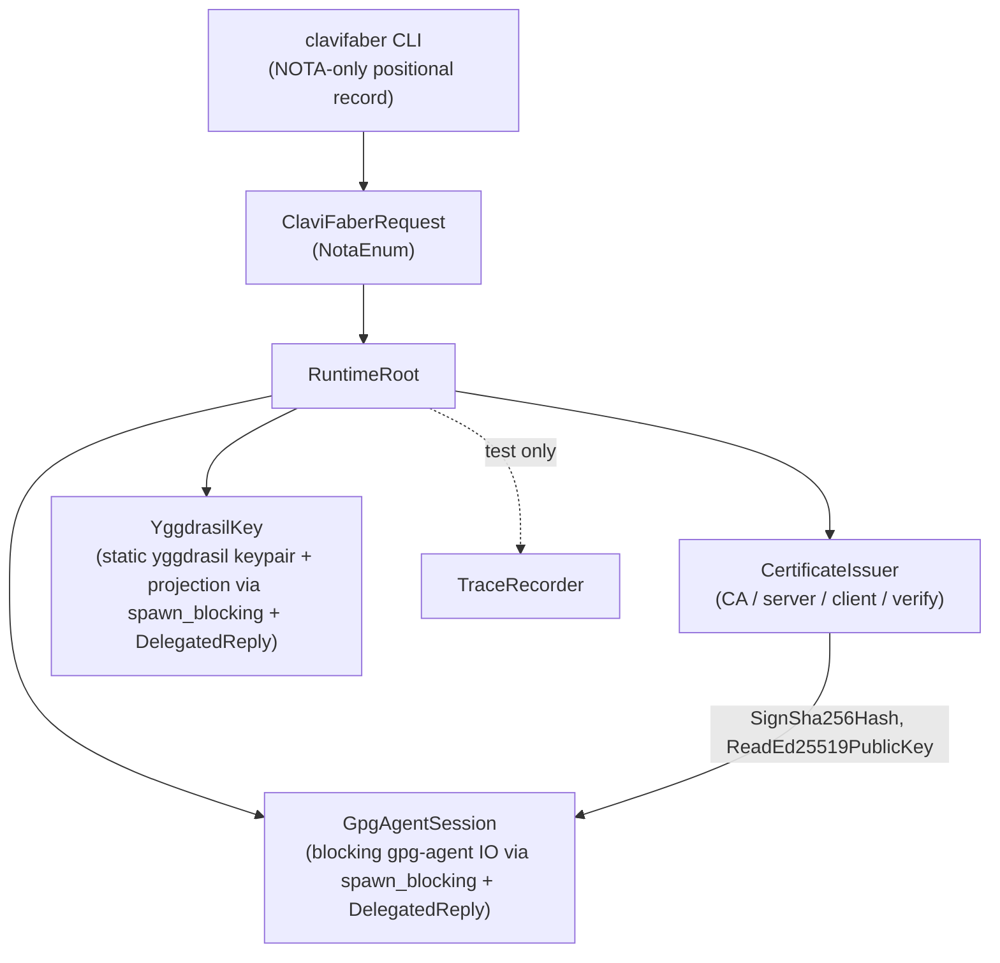

# ClaviFaber Architecture

ClaviFaber is a **host-key-material aggregator and certificate signer**
for CriomOS hosts. It does NOT create or own the host's SSH identity
— sshd does that, via NixOS's `services.openssh`. Clavifaber reads
sshd's `ssh_host_ed25519_key.pub` and aggregates it into the typed
`publication.nota` file alongside the Yggdrasil projection and the
WiFi-PKI client certificate.

It is **not** a convergence runner. The orchestration question — "is
this host's actual state matching the desired state?" — belongs to a
separate component (lojix today; whatever the cluster orchestrator
becomes tomorrow). Each request is idempotent on disk-existence;
sequencing them belongs to the caller.

## Operator surface

The CLI is **NOTA-only**: one positional NOTA record per invocation.
Each request kind has exactly one variant in `ClaviFaberRequest` and
prints exactly one variant of `ClaviFaberResponse` on stdout.

```sh
clavifaber "(CertificateAuthorityIssuance ([ABC123] [Cluster CA] [/var/lib/clavifaber/ca.pem]))"
clavifaber "(YggdrasilKeypairSetup ([/var/lib/clavifaber/yggdrasil/keypair.json]))"
clavifaber "(PublicKeyPublicationWriting (probus \
  (OpenSshPublicKeyLocation [/etc/ssh/ssh_host_ed25519_key.pub]) \
  (YggdrasilKeypairLocation [/var/lib/clavifaber/yggdrasil/keypair.json]) \
  None \
  [/var/lib/clavifaber/publication.nota]))"
```

The six request kinds:

| Request | What it does |
|---|---|
| `CertificateAuthorityIssuance` | Sign a CA cert against a GPG keygrip; idempotent on output existence (loud-fail on unparseable). |
| `ServerCertificateIssuance` | Mint a P-256 server keypair and sign the cert against the CA; idempotent (loud-fail on unparseable or half-existence). |
| `ClientCertificateIssuance` | Sign a client cert binding a host's SSH ed25519 public key (caller supplies the pubkey text); idempotent. |
| `CertificateChainVerification` | Verify a cert chains to a CA: issuer-DN + validity window + signature. |
| `YggdrasilKeypairSetup` | Generate the per-host Yggdrasil keypair file (mode 0600); return `(YggdrasilProjection address public_key)`. |
| `PublicKeyPublicationWriting` | Read sshd's `ssh.pub` + (optional) yggdrasil keypair + (optional) wifi cert file; assemble and atomically write `publication.nota`. |

## What clavifaber does NOT do

- **Create or rotate SSH host keys.** sshd owns
  `/etc/ssh/ssh_host_ed25519_key` (auto-generated by
  `services.openssh.enable = true` at first boot). Clavifaber reads
  the `.pub` half. If you want to rotate the host's SSH identity,
  rotate sshd's key — clavifaber's next run picks up the new pubkey
  automatically. The wifi-PKI client cert that bound the old pubkey
  becomes stale and must be re-issued (delete the cert file to force
  re-issuance per the per-handler loud-fail policy).
- **Convergence orchestration.** Each request is one focused
  operation; the caller sequences them.
- **Cluster-side consumers.** `publication.nota` lands on disk; whoever
  reads it (the cluster registry, peers via SSH pull, ...) is a
  separate component.
- **Rotation / renewal scheduling.** No timer-driven cert renewal.
  The actors that own each cert plane are the obvious owners when
  rotation lands.
- **State persistence beyond filesystem.** Each invocation reads and
  writes files directly. No sema, no redb, no daemon.

## Runtime topology

Four Kameo actors plus a test-only trace recorder.



**Why these actors.**

- **GpgAgentSession** is the blocking-IO anchor for gpg-agent. The
  crate-private `gpg_agent` module is reachable only from here
  (witness: `tests/forbidden_edges.rs`). `DelegatedReply` over
  `spawn_blocking` keeps the mailbox responsive while gpg signs.
- **CertificateIssuer** is the X.509 minting plane. Bridges typed
  signing requests + a signer closure to typed certificates by asking
  `GpgAgentSession` for the actual signature.
- **YggdrasilKey** is the blocking-IO anchor for the `yggdrasil`
  binary. Mints the keypair file and statically derives the public
  projection.
- **TraceRecorder** is test-only; production passes `None`.

**The publication-writing handler is NOT an actor.** It just reads
three files (sshd's `.pub`, optionally the yggdrasil keypair via
`YggdrasilKey`, optionally a wifi-cert PEM), assembles a typed record,
and writes it atomically. Stateless dispatch glue.

## Constraints

Each load-bearing constraint reads as one short sentence and maps to
a same-named witness test.

### Actor topology

| Constraint | Witness |
|---|---|
| Every actor type carries data (no public ZST actor markers). | `tests/actor_topology.rs::actor_types_carry_data_not_zero_size`. |
| The runtime root spawns every named actor. | `tests/actor_topology.rs::runtime_root_spawns_every_named_actor` (struct destructuring assertion). |
| `YggdrasilKey` projection runs `EnsureYggdrasilIdentity` before `ReadYggdrasilProjection`. | `tests/actor_trace.rs::yggdrasil_projection_runs_ensure_then_read`. |
| Only `gpg_agent_session.rs` reaches the `gpg_agent` module. | `tests/forbidden_edges.rs::only_gpg_agent_session_owns_the_gpg_agent_connection` + crate-private `mod gpg_agent`. |
| Only `src/yggdrasil.rs` + `src/actors/yggdrasil_key.rs` reach the yggdrasil binary. | `tests/forbidden_edges.rs::only_yggdrasil_key_owns_the_yggdrasil_binary`. |
| `GpgAgentSession`'s mailbox stays responsive during gpg-agent IO. | Code-shape: `Reply = DelegatedReply<R>` + `tokio::task::spawn_blocking`. |
| `YggdrasilKey`'s mailbox stays responsive during yggdrasil-binary IO. | Code-shape: same as above. |

### Per-handler idempotency (parse-before-skip)

| Constraint | Witness |
|---|---|
| `CertificateAuthorityIssuance` skips when the output is a valid PEM cert. | `tests/issuance_idempotency.rs::certificate_authority_issuance_skips_when_output_is_valid_cert`. |
| `CertificateAuthorityIssuance` fails loudly when the output exists but is unparseable. | `tests/issuance_idempotency.rs::certificate_authority_issuance_fails_loudly_when_output_unparseable`. |
| `ServerCertificateIssuance` skips when both output files are valid. | `tests/issuance_idempotency.rs::server_certificate_issuance_skips_when_output_files_are_valid`. |
| `ServerCertificateIssuance` fails loudly when the certificate file is unparseable. | `tests/issuance_idempotency.rs::server_certificate_issuance_fails_loudly_when_cert_unparseable`. |
| `ServerCertificateIssuance` fails loudly when the private-key file is unparseable. | `tests/issuance_idempotency.rs::server_certificate_issuance_fails_loudly_when_key_unparseable`. |
| `ServerCertificateIssuance` fails loudly on half-existence (cert without key). | `tests/issuance_idempotency.rs::server_certificate_issuance_fails_loudly_on_half_existence_cert_present`. |
| `ServerCertificateIssuance` fails loudly on half-existence (key without cert). | `tests/issuance_idempotency.rs::server_certificate_issuance_fails_loudly_on_half_existence_key_present`. |
| `ClientCertificateIssuance` skips when the output is a valid PEM cert. | `tests/issuance_idempotency.rs::client_certificate_issuance_skips_when_output_is_valid_cert`. |
| `ClientCertificateIssuance` fails loudly when the output exists but is unparseable. | `tests/issuance_idempotency.rs::client_certificate_issuance_fails_loudly_when_output_unparseable`. |
| `YggdrasilKeypairSetup` is idempotent: re-running preserves the keypair file. | `scripts/test-pki-lifecycle` Phase 7 (compares keypair bytes before/after re-run). |

### Publication contract

| Constraint | Witness |
|---|---|
| `PublicKeyPublicationWriting` reads sshd's `ssh.pub` verbatim into the publication. | `tests/publication_writing.rs::public_key_publication_writing_assembles_typed_record_atomically` (asserts publication's `open_ssh_public_key` field equals the on-disk `ssh_host_ed25519_key.pub` content). |
| `PublicKeyPublicationWriting` fails when sshd's `.pub` file is missing (clavifaber does NOT create one). | `tests/publication_writing.rs::public_key_publication_writing_fails_when_ssh_host_key_missing`. |
| `publication.nota` carries a typed `YggdrasilProjection` record. | `tests/publication_writing.rs::public_key_publication_writing_assembles_typed_record_atomically`. |
| `publication.nota` carries a typed `WifiClientCertificate` record. | Same test asserts on the typed wrapper. |
| `PublicKeyPublicationWriting` omits the typed planes when the caller passes `None`. | `tests/publication_writing.rs::public_key_publication_writing_omits_optional_planes_when_none`. |
| `publication.nota` is mode 0644 (publicly readable). | Same test asserts `stat -c %a` = 644. |

### Certificate validity

| Constraint | Witness |
|---|---|
| `CertificateChainVerification` rejects a certificate whose `not_after` is before the current clock. | `tests/certificate_validity_window.rs::verify_rejects_certificate_whose_not_after_is_before_clock`. |
| `CertificateChainVerification` rejects a certificate whose `not_before` is after the current clock. | `tests/certificate_validity_window.rs::verify_rejects_certificate_whose_not_before_is_after_clock`. |
| Validity check runs before signature check (loud signal for in-window certs with bad signatures). | `tests/certificate_validity_window.rs::verify_within_window_runs_signature_check_after_validity`. |

### Filesystem hygiene

| Constraint | Witness |
|---|---|
| All file writes go through `AtomicFile`; no partial files mid-write. | `tests/forbidden_edges.rs::all_file_writes_go_through_atomic_file`. |
| `publication.nota` mode 0644. | `tests/publication_writing.rs::public_key_publication_writing_assembles_typed_record_atomically`. |
| Yggdrasil keypair file mode 0600. | `scripts/test-pki-lifecycle` Phase 7. |

## Test contract

| Surface | Where |
|---|---|
| Pure Rust tests | `tests/*.rs` via `cargo test --all-targets` or `nix flake check` (4 derivations: build, test, fmt, clippy). |
| Impure end-to-end against real gpg-agent + yggdrasil + ssh-keygen | `nix run .#test-pki-lifecycle` (7 phases). |
| Rootless container e2e | `nix run .#test-deployment-sandbox` (uses bwrap, no sudo). |

## Code map

```
src/
├── lib.rs                  — module declarations
├── main.rs                 — #[tokio::main] CLI entry; one NOTA record in, one NOTA record out
├── error.rs                — Error enum (thiserror)
├── publication.rs          — PublicKeyPublication + WifiClientCertificate (typed publication record)
├── ssh_key.rs              — OpenSshPublicKey (data; parses ssh-ed25519 text into typed form)
├── yggdrasil.rs            — YggdrasilKeypairFile + YggdrasilProjection (data + serde_json field extraction)
├── x509.rs                 — Cert types + async issuer methods + CertificateChain validity-window check
├── util.rs                 — AtomicFile, AssuanLine (utilities)
├── gpg_agent.rs            — Assuan client (crate-private)
├── request.rs              — ClaviFaberRequest enum (6 variants), each handler's execute()
└── actors/
    ├── (mod via src/actors.rs)
    ├── runtime_root.rs     — RuntimeRoot owns every actor's ActorRef
    ├── gpg_agent_session.rs — GpgAgentSession actor + ReadEd25519PublicKey / SignSha256Hash (DelegatedReply over spawn_blocking)
    ├── yggdrasil_key.rs    — YggdrasilKey actor + EnsureYggdrasilIdentity / ReadYggdrasilProjection (DelegatedReply over spawn_blocking)
    ├── certificate_issuer.rs — CertificateIssuer actor + Issue* / Verify* messages (signer closure asks GpgAgentSession)
    └── trace_recorder.rs   — TraceRecorder actor (test-time only; production passes None)

tests/
├── actor_topology.rs           — actor types carry data; runtime root spawns all 4
├── actor_trace.rs              — yggdrasil ensure-then-read trace witness
├── forbidden_edges.rs          — gpg_agent + AtomicFile + yggdrasil ownership scans
├── issuance_idempotency.rs     — CA/server/client parse-before-skip + loud-fail witnesses
├── certificate_validity_window.rs — verify rejects expired / not-yet-valid certs
├── publication_writing.rs      — sshd's ssh.pub flows verbatim into publication; typed yggdrasil + wifi-cert wrappers
└── request_surface.rs          — NOTA round-trip witnesses

scripts/
├── test-pki-lifecycle          — impure 7-phase end-to-end (real gpg + yggdrasil + ssh-keygen)
└── test-deployment-sandbox     — rootless bwrap container e2e (no sudo)
```
