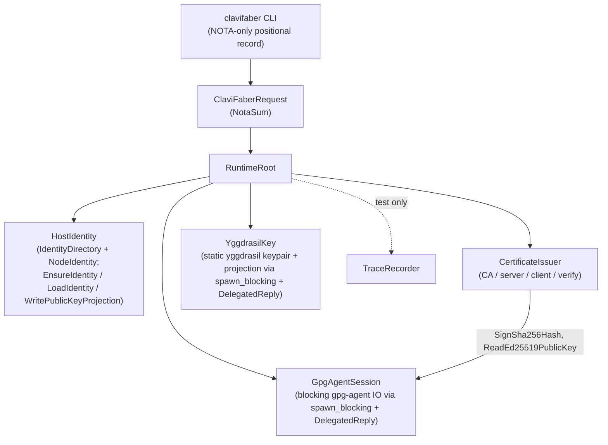

# ClaviFaber Architecture

ClaviFaber is a host-key-material producer. It mints, persists, and
projects the cryptographic identities a CriomOS host needs to participate
in the cluster: SSH ed25519 host identity, X.509 certificates against a
GPG-Ed25519 cluster CA, Yggdrasil keypair, and a typed `publication.nota`
file that other hosts (or future cluster components) read.

It is **not** a convergence runner. The orchestration question — "is this
host's actual state matching the desired state?" — belongs to a separate
component (lojix today; whatever the cluster orchestrator becomes
tomorrow). ClaviFaber answers requests like "set up this identity",
"sign this cert", "write the publication". Each request is idempotent on
disk-existence; sequencing them belongs to the caller.

## Operator surface

The CLI is **NOTA-only**: one positional NOTA record per invocation.
Each request kind has exactly one variant in `ClaviFaberRequest` and
prints exactly one variant of `ClaviFaberResponse` on stdout.

Examples:

```sh
clavifaber '(IdentitySetup "/var/lib/clavifaber/identity")'
clavifaber '(CertificateAuthorityIssuance ABC123 "Cluster CA" "/var/lib/clavifaber/ca.pem")'
clavifaber '(YggdrasilKeypairSetup "/var/lib/clavifaber/yggdrasil/keypair.json")'
clavifaber '(PublicKeyPublicationWriting probus "/var/lib/clavifaber/identity" \
  (YggdrasilKeypairLocation "/var/lib/clavifaber/yggdrasil/keypair.json") \
  None \
  "/var/lib/clavifaber/publication.nota")'
```

The eight request kinds:

| Request | What it does |
|---|---|
| `IdentitySetup` | Ensure SSH ed25519 host identity (key.pem + ssh.pub) under the named directory. Generate if missing; quarantine + replace if corrupt. |
| `OpenSshPublicKeyDerivation` | Re-derive ssh.pub from the persisted private key. |
| `CertificateAuthorityIssuance` | Sign a CA cert against a GPG keygrip; idempotent on output existence. |
| `ServerCertificateIssuance` | Mint a P-256 server keypair and sign the cert against the CA; idempotent on output existence. |
| `ClientCertificateIssuance` | Sign a client cert binding a host's SSH ed25519 public key; idempotent on output existence. |
| `CertificateChainVerification` | Verify a cert chains to a CA: issuer-DN match + validity window + signature. |
| `YggdrasilKeypairSetup` | Generate the per-host Yggdrasil keypair file (mode 0600); return the static `(YggdrasilProjection address public_key)`. |
| `PublicKeyPublicationWriting` | Assemble and atomically write `publication.nota` with typed identity / yggdrasil / wifi-cert fields. |

## Runtime topology

Five Kameo actors plus a test-only trace recorder.



**Why these actors and not others.**

- **HostIdentity** owns the on-disk SSH host identity. State-bearing
  across invocations of `EnsureIdentity` / `LoadIdentity`; failure-
  recoverable (corrupt-key quarantine flow). Folds `WritePublicKeyProjection`
  (formerly a separate `SshHostKey` actor): the projection is a
  method on the noun that owns the private key.
- **GpgAgentSession** is the blocking-IO anchor for gpg-agent. Crate-
  private `gpg_agent` module reachable only from here (witness:
  `tests/forbidden_edges.rs::only_gpg_agent_session_owns_the_gpg_agent_connection`).
  `DelegatedReply` over `spawn_blocking` keeps the mailbox responsive.
- **CertificateIssuer** is the X.509 minting plane. Bridges typed
  signing requests to typed certificates by asking `GpgAgentSession`
  via the signer-closure pattern.
- **YggdrasilKey** is the blocking-IO anchor for the `yggdrasil`
  binary (witness: `only_yggdrasil_key_owns_the_yggdrasil_binary`).
  Mints the keypair file and statically derives the public projection.
  Same `DelegatedReply` + `spawn_blocking` shape as `GpgAgentSession`.
- **TraceRecorder** is test-only; production passes `None` as the
  tracer. Tests pass an `ActorRef<TraceRecorder>` and assert on the
  ordered event sequence.

**What's NOT an actor and why.**

- Per-request handlers (in `src/request.rs`): each request type's
  `execute()` method orchestrates the actors needed for that request.
  These are not actors — they're stateless dispatch glue. Each request
  spins up a fresh `RuntimeRoot` (cheap; the per-request actors live
  for the duration of one CLI invocation).
- `AtomicFile` / `IdentityDirectory` / `YggdrasilKeypairFile` /
  `CertificateDer` / `OpenSshPublicKey` / `Pem types`: data-bearing
  types with sync methods. No mailbox semantics; used inside actor
  handlers.
- Inline-NOTA argv parser (`CommandLine` in `request.rs`): stateless
  decoding from `argv` to `ClaviFaberRequest`.

## Constraints

Each load-bearing constraint reads as one short sentence and maps to a
same-named witness test. Adding a constraint here without a witness is
a smell — name the witness first or move the constraint to a report.

### Actor topology

| Constraint | Witness |
|---|---|
| Every actor type carries data (no public ZST actor markers). | `tests/actor_topology.rs::actor_types_carry_data_not_zero_size` (mem::size_of for each actor > 0). |
| The runtime root spawns every named actor. | `tests/actor_topology.rs::runtime_root_spawns_every_named_actor` (struct destructuring assertion). |
| `HostIdentity` records receive + reply trace events on `EnsureIdentity`. | `tests/actor_trace.rs::ensure_identity_witness_records_host_identity_receive_and_reply`. |
| `OpenSshPublicKeyDerivation` flow runs `LoadIdentity` before `WritePublicKeyProjection` on the same actor. | `tests/actor_trace.rs::open_ssh_public_key_derivation_runs_load_identity_then_write_projection`. |
| `YggdrasilKey` projection runs `EnsureYggdrasilIdentity` before `ReadYggdrasilProjection`. | `tests/actor_trace.rs::yggdrasil_projection_runs_ensure_then_read`. |
| Only `gpg_agent_session.rs` reaches the `gpg_agent` module; other actors and request handlers must ask `GpgAgentSession` through its mailbox. | `tests/forbidden_edges.rs::only_gpg_agent_session_owns_the_gpg_agent_connection` (static source scan). The `gpg_agent` module is also crate-private (`mod gpg_agent` in `src/lib.rs`). |
| Only `src/yggdrasil.rs` (data) and `src/actors/yggdrasil_key.rs` (actor) reach the yggdrasil binary; other actors and request handlers must ask `YggdrasilKey` through its mailbox. | `tests/forbidden_edges.rs::only_yggdrasil_key_owns_the_yggdrasil_binary`. |
| `GpgAgentSession`'s mailbox stays responsive during gpg-agent IO. | Code-shape claim: `Reply = DelegatedReply<R>` + `tokio::task::spawn_blocking` for each gpg call. |
| `YggdrasilKey`'s mailbox stays responsive during yggdrasil-binary IO. | Code-shape claim: `Reply = DelegatedReply<R>` + `tokio::task::spawn_blocking` for each yggdrasil invocation. |

### Per-handler idempotency

| Constraint | Witness |
|---|---|
| `IdentitySetup` is idempotent: re-running preserves the on-disk private key. | `tests/identity_directory_lifecycle.rs::identity_setup_preserves_existing_identity`. |
| `IdentitySetup` quarantines a corrupt private key before regeneration. | `tests/identity_directory_lifecycle.rs::identity_setup_quarantines_corrupt_private_key_before_replacement`. |
| `OpenSshPublicKeyDerivation` re-derives the public projection from the persisted private key. | `tests/identity_directory_lifecycle.rs::open_ssh_public_key_derivation_restores_public_projection_from_private_key`. |
| `OpenSshPublicKeyDerivation` fails when no private key is present. | `tests/identity_directory_lifecycle.rs::open_ssh_public_key_derivation_fails_when_private_key_is_absent`. |
| `CertificateAuthorityIssuance` skips when the output file already exists (no CA read, no gpg-agent traffic). | `tests/issuance_idempotency.rs::certificate_authority_issuance_skips_when_output_exists` (bogus keygrip succeeds via skip path). |
| `ServerCertificateIssuance` skips when both output files exist. | `tests/issuance_idempotency.rs::server_certificate_issuance_skips_when_output_files_exist`. |
| `ClientCertificateIssuance` skips when the output file exists. | `tests/issuance_idempotency.rs::client_certificate_issuance_skips_when_output_exists`. |
| `YggdrasilKeypairSetup` is idempotent: re-running preserves the keypair file. | `scripts/test-pki-lifecycle` Phase 8 (compares keypair bytes before / after re-run). |

### Certificate validity

| Constraint | Witness |
|---|---|
| `CertificateChainVerification` rejects a certificate whose `not_after` is before the current clock. | `tests/certificate_validity_window.rs::verify_rejects_certificate_whose_not_after_is_before_clock`. |
| `CertificateChainVerification` rejects a certificate whose `not_before` is after the current clock. | `tests/certificate_validity_window.rs::verify_rejects_certificate_whose_not_before_is_after_clock`. |
| `CertificateChainVerification` runs the signature check after the validity check (so a cert in-window with a bogus signature reports the signature failure, not a validity failure). | `tests/certificate_validity_window.rs::verify_within_window_runs_signature_check_after_validity`. |

### Filesystem hygiene

| Constraint | Witness |
|---|---|
| The identity directory is mode 0700; `key.pem` is 0600; `ssh.pub` is 0644. | `tests/identity_directory_lifecycle.rs::identity_setup_creates_private_key_and_public_key_with_stable_modes` and `…leaves_stable_modes_and_no_temporary_files`. |
| `publication.nota` is written with mode 0644 (publicly readable). | `tests/publication_writing.rs::public_key_publication_writing_assembles_typed_record_atomically`. |
| The Yggdrasil keypair file is written with mode 0600 (private host material). | `scripts/test-pki-lifecycle` Phase 8 (asserts `stat -c %a` is 600). |
| All file writes go through `AtomicFile` (write-then-rename); no partial files visible mid-write. | `tests/forbidden_edges.rs::all_file_writes_go_through_atomic_file` (no `fs::write` / `File::create` outside `util.rs`). |

### Public projection contract

| Constraint | Witness |
|---|---|
| `publication.nota` carries a typed `YggdrasilProjection` record (not separate opaque strings). | `tests/publication_writing.rs::public_key_publication_writing_assembles_typed_record_atomically` (asserts the publication contains a typed `YggdrasilProjection` with `address` + `public_key` fields). |
| `publication.nota` carries a typed `WifiClientCertificate` record (not an opaque PEM string field). | Same test asserts on the typed `WifiClientCertificate { pem }` wrapper. |
| `PublicKeyPublicationWriting` omits the typed planes when the caller passes `None`. | `tests/publication_writing.rs::public_key_publication_writing_omits_optional_planes_when_none`. |
| Private key bytes (PKCS#8 PEM, GPG-managed CA private key, Yggdrasil private key, server private key) never appear on stdout or stderr. | Source-shape claim — no response variant carries private material; reinforced by the per-handler tests not finding `BEGIN PRIVATE KEY` markers in stdout. |

## Test contract

| Surface | Where |
|---|---|
| Pure Rust tests | `tests/*.rs`, run via `cargo test --all-targets` or `nix flake check` (4 derivations: build, test, fmt, clippy). |
| Impure end-to-end against real gpg-agent + yggdrasil | `nix run .#test-pki-lifecycle` (8 phases). |

Run both before commit; commit only when both are green.

## Code map

```
src/
├── lib.rs                  — module declarations
├── main.rs                 — #[tokio::main] CLI entry; one NOTA record in, one NOTA record out
├── error.rs                — Error enum (thiserror)
├── identity.rs             — IdentityDirectory + NodeIdentity (data)
├── publication.rs          — PublicKeyPublication + WifiClientCertificate (typed publication record)
├── ssh_key.rs              — OpenSshPublicKey (data)
├── yggdrasil.rs            — YggdrasilKeypairFile + YggdrasilProjection (data + serde_json field extraction)
├── x509.rs                 — Cert types + async issuer methods (signer closure) + CertificateChain validity-window check
├── util.rs                 — AtomicFile, AssuanLine (utilities)
├── gpg_agent.rs            — Assuan client (crate-private)
├── request.rs              — ClaviFaberRequest enum (8 variants), each handler's execute()
└── actors/
    ├── (mod via src/actors.rs)
    ├── runtime_root.rs     — RuntimeRoot owns every actor's ActorRef
    ├── host_identity.rs    — HostIdentity actor + EnsureIdentity / LoadIdentity / WritePublicKeyProjection
    ├── gpg_agent_session.rs — GpgAgentSession actor + ReadEd25519PublicKey / SignSha256Hash (DelegatedReply over spawn_blocking)
    ├── yggdrasil_key.rs    — YggdrasilKey actor + EnsureYggdrasilIdentity / ReadYggdrasilProjection (DelegatedReply over spawn_blocking)
    ├── certificate_issuer.rs — CertificateIssuer actor + Issue* / Verify* messages (signer closure asks GpgAgentSession)
    └── trace_recorder.rs   — TraceRecorder actor (test-time only; production passes None)

tests/
├── actor_topology.rs            — actor types carry data; runtime root spawns all 5
├── actor_trace.rs               — receive/reply trace witnesses
├── forbidden_edges.rs           — gpg_agent + AtomicFile + yggdrasil ownership scans
├── identity_directory_lifecycle.rs — identity setup, quarantine, derivation, mode bits
├── issuance_idempotency.rs      — CA / server / client cert handlers skip when output files exist
├── certificate_validity_window.rs — verify rejects expired / not-yet-valid certs (primary-4kr witness)
├── publication_writing.rs       — typed YggdrasilProjection + WifiClientCertificate in publication.nota
└── request_surface.rs           — NOTA round-trip + inline-NOTA CLI dispatch

scripts/
└── test-pki-lifecycle           — impure 8-phase end-to-end (real gpg-agent + real yggdrasil)
```

24 cargo tests + 4 nix flake checks + 8 pki-lifecycle phases.

## What clavifaber does NOT do

- **Convergence orchestration.** Deciding "should I run?" or "is the
  system in the desired state?" belongs to an orchestrator component
  (lojix today; future cluster orchestrator). Each clavifaber request
  is one focused operation; the caller sequences them.
- **Cluster-side consumers.** The `publication.nota` file is written
  to a public-readable path (mode 0644). Whoever reads and aggregates
  these across hosts is a separate component (the haywire stage today
  is "an SSH user pulls each host's file").
- **Rotation / renewal.** No timer-driven cert renewal; no SSH key
  rotation; no Yggdrasil keypair rotation. The actors that own each
  plane are the obvious owners for rotation when that work lands.
- **State persistence beyond filesystem.** Each invocation reads and
  writes files directly. No sema, no redb, no daemon-side state.
