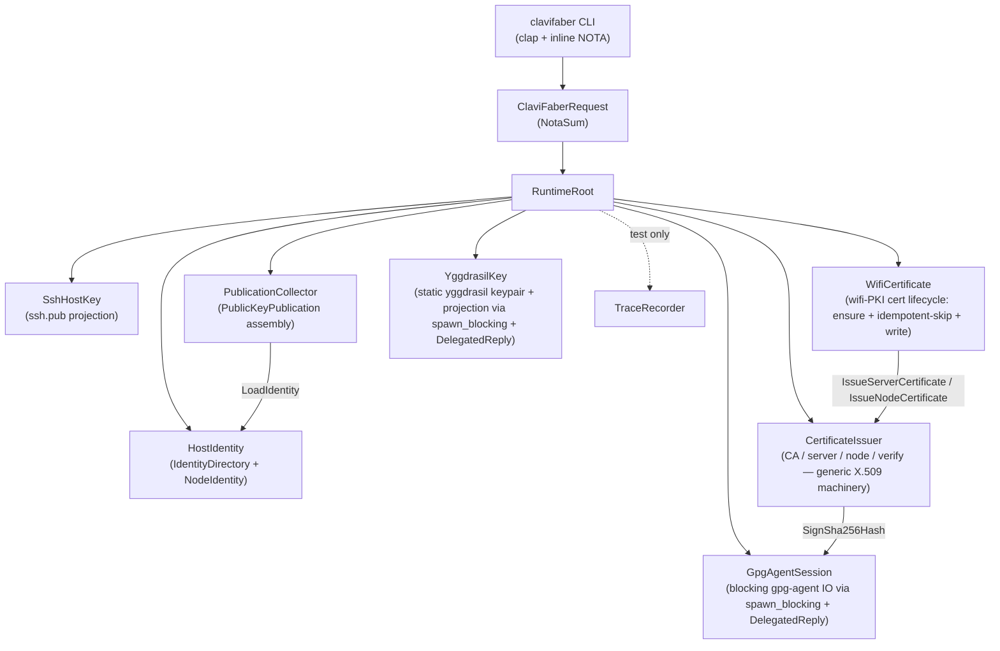

# ClaviFaber Architecture

ClaviFaber forms and publishes host key material for CriomOS nodes. It is a
local authority over private host material and a producer of public
projections; it is not the cluster database itself.

## Runtime topology

Every plane is owned by a Kameo actor. The runtime root spawns the five named
actors and one optional trace recorder; CLI requests dispatch by sending typed
messages to the appropriate actor.



The six request planes below each map to one or more actors. The actor noun
owns the plane's state, accepts typed messages, and emits typed replies.

## Planes

### Local Material

The local material plane owns private key creation and repair. Private key
bytes must stay out of stdout, logs, reports, test fixtures, and the Nix
store. The current implementation creates an Ed25519 node identity directory
with:

- `key.pem`: PKCS#8 private key, mode `0600`.
- `ssh.pub`: OpenSSH public key projection, mode `0644`.

The directory is mode `0700`. If the private key is corrupt, ClaviFaber moves
it aside before generating replacement material. The broken material remains
local for forensic inspection.

**Actors**: `HostIdentity` owns the identity directory and node identity;
accepts `EnsureIdentity` (load-or-generate-and-write) and `LoadIdentity`
(read-only). `SshHostKey` owns the public-key projection file; accepts
`WritePublicKeyProjection { directory, identity }`.

### Public Projection

The public projection plane turns private material into records other hosts
can trust. Today this includes the OpenSSH public key, the Yggdrasil identity
projection (hex public key + IPv6 address), and X.509 certificates for the
CriomOS WiFi PKI path. The intended cluster bundle also includes any WiFi
client certificate public metadata needed by the cluster database.

This plane produces `PublicKeyPublication` records. Consumers must not poll
arbitrary files looking for key changes; producers push a complete current
public projection when material is created or repaired.

**Actor**: `PublicationCollector` owns publication assembly; accepts
`CollectPublication { node_name, directory, yggdrasil: Option<YggdrasilProjection>, wifi_* }`
and returns `PublicKeyPublication`. Internally asks `HostIdentity` for the
current node identity.

### WiFi PKI

The wifi-PKI plane owns the lifecycle of the EAP-TLS certs used to admit
hosts onto the cluster's WiFi: an AP-side server cert and per-host client
certs. The X.509 issuance machinery lives in `CertificateIssuer` (which
asks `GpgAgentSession` for the GPG-Ed25519 signature). `WifiCertificate`
sits above it as the wifi-named domain plane: it knows when each cert
already exists on disk (idempotent-skip avoids the gpg-agent round-trip)
and which paths the wifi-PKI uses.

**Actor**: `WifiCertificate` accepts `EnsureWifiServerCertificate
{ plan: WifiServerCertificatePlan }` and `EnsureWifiClientCertificate
{ plan: WifiClientCertificatePlan }`. Both replies are
`Result<(), Error>`. The handler returns immediately when the named
output files already exist (no CA read, no gpg-agent ask); otherwise it
loads the CA, asks `CertificateIssuer` for the typed signing request,
and writes the result atomically (server cert+key with mode 0644/0600;
client cert with mode 0644). The `Reply` is not `DelegatedReply` — the
`ask` to `CertificateIssuer` is non-blocking from the runtime's
perspective (the blocking gpg call is already wrapped in
`spawn_blocking` inside `GpgAgentSession`).

The CA itself is not wifi-shaped (a CA can sign anything), so the CA
issuance plane stays in `Converge::run_actors` calling
`CertificateIssuer.IssueCertificateAuthority` directly via the
`converge_certificate_authority` helper.

Rotation is parked: v1 has no renewal scheduler, no redb-persisted
deadline, no `RenewBeforeExpiry` message. The keypair-and-cert
lifecycle owner is named today so renewal lands on it later — same
shape as `YggdrasilKey`.

### Yggdrasil Identity

The Yggdrasil identity plane owns the per-host Yggdrasil keypair file
(mode 0600) and projects it to the public hex public key + IPv6 address that
other hosts consume. The keypair file's on-disk shape is
`{"PrivateKey": "<128 hex>"}` — the same shape CriomOS's
`network/yggdrasil.nix` consumes via `preCriadJson` (it merges this file with
the runtime network overlay before invoking yggdrasild).

Public projection is derived **statically** by invoking
`yggdrasil -useconffile <keypair_path> -publickey -address`. Clavifaber never
starts the daemon. The keypair, once minted, is stable across re-converge
calls — rotation is parked (renewal scheduler is a separate concern, not in
the v1 plane).

**Actor**: `YggdrasilKey` owns the keypair file and the static projection;
accepts `EnsureYggdrasilIdentity { keypair_path }` (idempotent: writes the
keypair atomically with mode 0600 if absent) and `ReadYggdrasilProjection
{ keypair_path }` (returns `YggdrasilProjection { public_key, address }` by
running yggdrasil statically). Both handlers use
`tokio::task::spawn_blocking` + `DelegatedReply` so the actor's mailbox stays
responsive while the subprocess runs. The `yggdrasil` binary is resolved from
the process PATH (override with `CLAVIFABER_YGGDRASIL_BIN`); CriomOS's
`complex-init` systemd service supplies it via `Path = [ pkgs.yggdrasil ]`.

### Certificate Authority

The certificate-authority plane bridges a GPG Ed25519 signing key into X.509
certificates. It currently supports:

- a self-signed CA certificate from a GPG keygrip,
- a P-256 server key and certificate,
- a node certificate from an Ed25519 OpenSSH public key,
- issuer and signature verification against the CA certificate.

Certificate construction lives in `src/x509.rs`'s data-bearing types
(`CertificateAuthorityIssuer`, `UnsignedCertificate`,
`CertificateAuthorityCertificateRequest`, `ServerCertificateSigningRequest`,
`NodeCertificateSigningRequest`, `CertificateChain`). The issuer methods are
**async** and take a signer closure parameter — the actor supplies a closure
that asks `GpgAgentSession` for the signature, so x509 has no direct
dependency on `gpg-agent`.

**Actors**: `CertificateIssuer` accepts `IssueCertificateAuthority`,
`IssueServerCertificate`, `IssueNodeCertificate`, `VerifyCertificateChain`.
`GpgAgentSession` is the sole owner of `gpg-agent` connections; accepts
`ReadEd25519PublicKey { keygrip }` and `SignSha256Hash { keygrip, hash_hex }`.
The actor uses `tokio::task::spawn_blocking` + `DelegatedReply` so its
mailbox stays responsive while the synchronous gpg-agent call runs.

### Publication

The publication plane emits a typed public-key publication record for the
component that owns the cluster database. ClaviFaber does not mutate cluster
state directly and does not learn ad hoc paths into unrelated repositories.
ClaviFaber's contract ends at a complete public `PublicKeyPublication`
record; the long-lived consumer that takes that record into the cluster
database lives in a separate component.

## Command Surface

The current Clap command line exists for compatibility with the extracted
prototype. The operator surface is a single Nota request argument with typed
request and result records. No new flag/subcommand surface should be added
unless it is explicitly a temporary compatibility bridge.

Example:

```sh
clavifaber '(IdentityDirectoryInitialization "/var/lib/clavifaber")'
clavifaber '(PublicKeyPublicationRequest probus "/var/lib/clavifaber" None None None)'
```

The CLI binary uses `#[tokio::main]`. Each request type's `execute()` method
is `async` and dispatches through actors via the typed `Message<T>` impls
above.

## Convergence

ClaviFaber is a **convergence runner**: a one-shot host service that brings
the on-disk state in line with the desired state declared in the input
NOTA `Converge` request, then exits. The actual state is the filesystem
(key.pem, ssh.pub, certs, publication.nota); the desired state is the
input. Convergence is bringing actual to match desired and stopping.

A sema database (`clavifaber.redb`) holds a per-host **convergence
ledger** — a single row keyed `"converge"` with the hash of the last
successfully converged input. On startup the runner hashes the current
input and compares to the ledger:

- match → exit immediately with `work_performed = false` (the
  "should I run?" gate);
- mismatch → run the actor topology, write the new hash on success,
  exit with `work_performed = true`.

The gate makes idle activations cheap: clavifaber can fire on every
lojix activation and exit in milliseconds when nothing's changed.

The current convergence steps in order: ensure host identity → optionally
issue CA cert → optionally issue server cert → for each node-cert plan,
issue node cert → optionally ensure Yggdrasil keypair + read projection →
assemble `PublicKeyPublication` → atomic write to `publication.nota`. The
publication file is the haywire-stage cluster contract: an SSH-readable
consumer pulls each host's `publication.nota` manually until the networked
exchange protocol lands.

## Constraints

These are the load-bearing obligations clavifaber must satisfy. Each
constraint reads as one short sentence and maps to a same-named witness
test (or witness pattern) under `tests/`. Adding a constraint here without
a witness is a smell — name the witness first or move the constraint to a
report.

### Actor topology

| Constraint | Witness |
|---|---|
| Every actor type carries data (no public ZST actor markers). | `tests/actor_topology.rs::actor_types_carry_data_not_zero_size` (mem::size_of for each actor > 0). |
| The runtime root spawns every named actor. | `tests/actor_topology.rs::runtime_root_spawns_every_named_actor` (struct destructuring assertion). |
| `HostIdentity` records receive + reply trace events on `EnsureIdentity`. | `tests/actor_trace.rs::ensure_identity_witness_records_host_identity_receive_and_reply`. |
| `PublicKeyDerivation` flow runs `HostIdentity.LoadIdentity` before `SshHostKey.WritePublicKeyProjection`. | `tests/actor_trace.rs::public_key_derivation_runs_host_identity_then_ssh_host_key`. |
| `YggdrasilKey` projection runs `EnsureYggdrasilIdentity` before `ReadYggdrasilProjection`. | `tests/actor_trace.rs::yggdrasil_projection_runs_ensure_then_read`. |
| `WifiCertificate` is the sole owner of wifi-PKI cert issuance from the convergence path. | `tests/actor_trace.rs::wifi_certificate_records_server_certificate_request` and `wifi_certificate_records_client_certificate_request` (skip-path mailbox witnesses). |
| `WifiCertificate` skips re-issuance when output files already exist (no CA read, no gpg-agent traffic). | `tests/converge.rs::converge_skips_wifi_certificate_issuance_when_files_already_exist` (Converge with bogus keygrip succeeds because the actor short-circuits on disk-existence). |
| Only `gpg_agent_session.rs` reaches the `gpg_agent` module; other actors and request handlers must ask `GpgAgentSession` through its mailbox. | `tests/forbidden_edges.rs::only_gpg_agent_session_owns_the_gpg_agent_connection` (static source scan). The `gpg_agent` module is also crate-private (`mod gpg_agent` in `src/lib.rs`). |
| `GpgAgentSession`'s mailbox stays responsive during gpg-agent IO. | Code-shape claim: `Reply = DelegatedReply<R>` + `tokio::task::spawn_blocking` for each gpg call (see `src/actors/gpg_agent_session.rs`). Future runtime witness needs an injectable signer. |
| `YggdrasilKey`'s mailbox stays responsive during yggdrasil-binary IO. | Code-shape claim: `Reply = DelegatedReply<R>` + `tokio::task::spawn_blocking` for each yggdrasil invocation (see `src/actors/yggdrasil_key.rs`). |

### Convergence

| Constraint | Witness |
|---|---|
| Convergence skips actor work when the input hash matches the last-converged hash in sema. | `tests/converge.rs::converge_skips_when_input_hash_matches_last_converged` (deletes publication.nota between runs and asserts the second run does not re-create it). |
| Changing any field of the input plan triggers re-convergence. | `tests/converge.rs::converge_re_runs_when_input_changes` (mutates `node_name` between runs and asserts the publication content changes). |
| Re-converging with byte-identical input produces a byte-identical publication on disk. | `tests/converge.rs::converge_is_idempotent_against_existing_identity`. |
| `clavifaber.redb` is durable across process invocations and readable by the authoritative sema reader. | Chained Nix derivations: `checks.state-write` runs `Converge` and emits `clavifaber.redb` as `$out`; `checks.state-read` invokes `(InspectState …)` against that file and asserts a `ConvergeLedger` row was committed. |
| The sema schema-version guard hard-fails on mismatch. | `tests/state_schema.rs::sema_open_with_wrong_schema_version_hard_fails` (writes a redb with a different schema header, asserts open errors). |

### Filesystem hygiene

| Constraint | Witness |
|---|---|
| The identity directory is mode 0700; `key.pem` is 0600; `ssh.pub` is 0644. | `tests/identity_directory_lifecycle.rs::complex_init_creates_private_key_public_key_and_public_stdout_projection` and `…leaves_stable_modes_and_no_temporary_files`. |
| `publication.nota` is written with mode 0644 (publicly readable). | `tests/converge.rs::converge_writes_publication_with_644_mode`. |
| `clavifaber.redb` is created with mode 0600 (private to the service user). | `tests/converge.rs::converge_creates_state_database_with_600_mode`. |
| The Yggdrasil keypair file is written with mode 0600 (private host material). | `tests/converge.rs::converge_with_yggdrasil_plan_populates_publication_and_keypair_file`. |
| The Yggdrasil keypair is stable across re-converge (no silent rotation). | `tests/converge.rs::converge_with_yggdrasil_plan_is_idempotent_on_keypair`. |
| All file writes go through `AtomicFile` (write-then-rename); no partial files visible mid-write. | Source scan: `tests/forbidden_edges.rs::all_file_writes_go_through_atomic_file` (no `fs::write` / `File::create` outside `util.rs`). |
| A corrupt private key is preserved (renamed to `key.pem.broken.<timestamp>`) before regeneration. | `tests/identity_directory_lifecycle.rs::complex_init_quarantines_corrupt_private_key_before_replacement`. |

### Private bytes never leak

| Constraint | Witness |
|---|---|
| Private key bytes (PKCS#8 PEM) never appear in the binary's stdout. | `tests/converge.rs::converge_does_not_emit_private_key_bytes_on_stdout`. |
| Private key bytes never appear in the binary's stderr. | Same test asserts on stderr too. |
| Private key bytes never appear in any NOTA response value. | Source-shape claim — no response variant carries private material; reinforced by the stdout/stderr witness above. |
| Yggdrasil private key bytes never leak — only the hex public key and IPv6 address reach the publication. | Source-shape claim: `YggdrasilProjection` carries only `public_key` + `address`; `CollectPublication` projects only those into `PublicKeyPublication`. The keypair file (mode 0600) is the only durable carrier of the private bytes. |

## Test Contract

Pure Rust tests run through `nix flake check`:

- `tests/identity_directory_lifecycle.rs`: identity directory permissions,
  public-key derivation, corruption recovery, idempotent re-init.
- `tests/request_surface.rs`: NOTA request/response round-trip,
  inline-NOTA CLI dispatch.
- `tests/actor_topology.rs`: actor data-carrying + runtime root spawn.
- `tests/actor_trace.rs`: trace-pattern witnesses.
- `tests/forbidden_edges.rs`: GpgAgentSession encapsulation, AtomicFile
  enforcement.
- `tests/converge.rs`: end-to-end convergence flow including the
  sema-backed gate, cert-plan NOTA round-trip, mode-bit witnesses, and
  the no-private-bytes-on-stdout witness.
- `tests/state_schema.rs`: sema schema-version guard.

Two chained Nix derivations as `checks.state-write` and `checks.state-read`
witness state durability across separate processes (skills/architectural-truth-tests.md
§"Nix-chained tests").

The GPG/gpg-agent lifecycle is an impure integration test exposed as:

```sh
nix run .#test-pki-lifecycle
```

Tests should be named by their behavioral premise and should use fixture
nouns instead of inline command plumbing.

## Code map

```
src/
├── lib.rs                 — module declarations + re-exports
├── main.rs                — CLI entry point (#[tokio::main])
├── error.rs               — crate Error enum
├── identity.rs            — IdentityDirectory + NodeIdentity (data-bearing)
├── publication.rs         — PublicKeyPublication + PublicKeyPublicationRequest
├── ssh_key.rs             — OpenSshPublicKey
├── yggdrasil.rs           — YggdrasilKeypairFile + YggdrasilPlan + YggdrasilProjection
├── x509.rs                — Cert types + async issuer methods (signer closure)
├── util.rs                — AtomicFile, AssuanLine
├── gpg_agent.rs           — Assuan client (crate-private; only gpg_agent_session reaches it)
├── request.rs             — ClaviFaberRequest dispatch (async, routes through actors)
└── actors/
    ├── (mod via src/actors.rs)
    ├── runtime_root.rs    — RuntimeRoot owns every actor's ActorRef
    ├── host_identity.rs   — HostIdentity actor + EnsureIdentity / LoadIdentity messages
    ├── ssh_host_key.rs    — SshHostKey actor + WritePublicKeyProjection message
    ├── gpg_agent_session.rs — GpgAgentSession actor + ReadEd25519PublicKey / SignSha256Hash (DelegatedReply over spawn_blocking)
    ├── yggdrasil_key.rs   — YggdrasilKey actor + EnsureYggdrasilIdentity / ReadYggdrasilProjection (DelegatedReply over spawn_blocking)
    ├── certificate_issuer.rs — CertificateIssuer actor + Issue* / Verify* messages (signer closure asks GpgAgentSession)
    ├── wifi_certificate.rs — WifiCertificate actor + EnsureWifiServerCertificate / EnsureWifiClientCertificate (idempotent skip on disk existence; routes to CertificateIssuer)
    ├── publication_collector.rs — PublicationCollector actor + CollectPublication (asks HostIdentity)
    └── trace_recorder.rs  — TraceRecorder actor (test-time tracing; production passes None)
```
