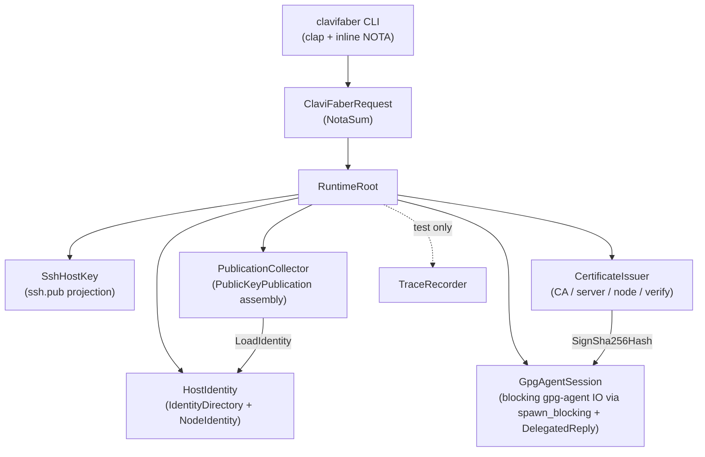

# ClaviFaber Architecture

ClaviFaber forms and publishes host key material for CriomOS nodes. It is a
local authority over private host material and a producer of public
projections; it is not the cluster database itself.

## Runtime topology

Every plane is owned by a Kameo actor. The runtime root spawns the five named
actors and one optional trace recorder; CLI requests dispatch by sending typed
messages to the appropriate actor.



The four request planes below each map to one or more actors. The actor noun
owns the plane's state, accepts typed messages, and emits typed replies.

## Planes

### Local Material

The local material plane owns private key creation and repair. Private key
bytes must stay out of stdout, logs, reports, test fixtures, and the Nix
store. The current implementation creates an Ed25519 node identity directory
with:

- `key.pem`: PKCS#8 private key, mode `0600`.
- `ssh.pub`: OpenSSH public key projection, mode `0644`.

The directory is mode `0700`. If the private key is corrupt, ClaviFaber moves
it aside before generating replacement material. The broken material remains
local for forensic inspection.

**Actors**: `HostIdentity` owns the identity directory and node identity;
accepts `EnsureIdentity` (load-or-generate-and-write) and `LoadIdentity`
(read-only). `SshHostKey` owns the public-key projection file; accepts
`WritePublicKeyProjection { directory, identity }`.

### Public Projection

The public projection plane turns private material into records other hosts
can trust. Today this includes the OpenSSH public key and X.509 certificates
for the CriomOS WiFi PKI path. The intended cluster bundle also includes
Yggdrasil identity material and any WiFi client certificate public metadata
needed by the cluster database.

This plane produces `PublicKeyPublication` records. Consumers must not poll
arbitrary files looking for key changes; producers push a complete current
public projection when material is created or repaired.

**Actor**: `PublicationCollector` owns publication assembly; accepts
`CollectPublication { node_name, directory, yggdrasil_*, wifi_* }` and
returns `PublicKeyPublication`. Internally asks `HostIdentity` for the
current node identity.

### Certificate Authority

The certificate-authority plane bridges a GPG Ed25519 signing key into X.509
certificates. It currently supports:

- a self-signed CA certificate from a GPG keygrip,
- a P-256 server key and certificate,
- a node certificate from an Ed25519 OpenSSH public key,
- issuer and signature verification against the CA certificate.

Certificate construction lives in `src/x509.rs`'s data-bearing types
(`CertificateAuthorityIssuer`, `UnsignedCertificate`,
`CertificateAuthorityCertificateRequest`, `ServerCertificateSigningRequest`,
`NodeCertificateSigningRequest`, `CertificateChain`). The issuer methods are
**async** and take a signer closure parameter — the actor supplies a closure
that asks `GpgAgentSession` for the signature, so x509 has no direct
dependency on `gpg-agent`.

**Actors**: `CertificateIssuer` accepts `IssueCertificateAuthority`,
`IssueServerCertificate`, `IssueNodeCertificate`, `VerifyCertificateChain`.
`GpgAgentSession` is the sole owner of `gpg-agent` connections; accepts
`ReadEd25519PublicKey { keygrip }` and `SignSha256Hash { keygrip, hash_hex }`.
The actor uses `tokio::task::spawn_blocking` + `DelegatedReply` so its
mailbox stays responsive while the synchronous gpg-agent call runs.

### Publication

The publication plane emits a typed public-key publication record for the
component that owns the cluster database. ClaviFaber does not mutate cluster
state directly and does not learn ad hoc paths into unrelated repositories.
ClaviFaber's contract ends at a complete public `PublicKeyPublication`
record; the long-lived consumer that takes that record into the cluster
database lives in a separate component.

## Command Surface

The current Clap command line exists for compatibility with the extracted
prototype. The operator surface is a single Nota request argument with typed
request and result records. No new flag/subcommand surface should be added
unless it is explicitly a temporary compatibility bridge.

Example:

```sh
clavifaber '(IdentityDirectoryInitialization "/var/lib/clavifaber")'
clavifaber '(PublicKeyPublicationRequest probus "/var/lib/clavifaber" None None None)'
```

The CLI binary uses `#[tokio::main]`. Each request type's `execute()` method
is `async` and dispatches through actors via the typed `Message<T>` impls
above.

## Constraints

These are the load-bearing obligations the actor topology must satisfy. Each
constraint maps to one or more architectural-truth tests under `tests/`.

| Constraint | Witness |
|---|---|
| Every actor type carries data (no public ZST actor markers). | `tests/actor_topology.rs::actor_types_carry_data_not_zero_size` (mem::size_of for each actor > 0). |
| The runtime root spawns every named actor. | `tests/actor_topology.rs::runtime_root_spawns_every_named_actor` (struct destructuring assertion). |
| `HostIdentity` records receive + reply trace events on `EnsureIdentity`. | `tests/actor_trace.rs::ensure_identity_witness_records_host_identity_receive_and_reply`. |
| `PublicKeyDerivation` flow runs `HostIdentity.LoadIdentity` before `SshHostKey.WritePublicKeyProjection`. | `tests/actor_trace.rs::public_key_derivation_runs_host_identity_then_ssh_host_key`. |
| Only `gpg_agent_session.rs` reaches the `gpg_agent` module; other actors and request handlers must ask `GpgAgentSession` through its mailbox. | `tests/forbidden_edges.rs::only_gpg_agent_session_owns_the_gpg_agent_connection` (static source scan). The `gpg_agent` module is also crate-private (`mod gpg_agent` in `src/lib.rs`). |

## Test Contract

Pure Rust tests run through `nix flake check`:

- `tests/identity_directory_lifecycle.rs` (6 tests): identity directory
  permissions, public-key derivation, corruption recovery, idempotent
  re-init.
- `tests/request_surface.rs` (3 tests): NOTA request/response round-trip,
  inline-NOTA CLI dispatch.
- `tests/actor_topology.rs` (2 tests): actor data-carrying + runtime root
  spawn.
- `tests/actor_trace.rs` (2 tests): trace-pattern witnesses.
- `tests/forbidden_edges.rs` (1 test): GpgAgentSession encapsulation.

The GPG/gpg-agent lifecycle is an impure integration test exposed as:

```sh
nix run .#test-pki-lifecycle
```

Tests should be named by their behavioral premise and should use fixture
nouns instead of inline command plumbing.

## Code map

```
src/
├── lib.rs                 — module declarations + re-exports
├── main.rs                — CLI entry point (#[tokio::main])
├── error.rs               — crate Error enum
├── identity.rs            — IdentityDirectory + NodeIdentity (data-bearing)
├── publication.rs         — PublicKeyPublication + PublicKeyPublicationRequest
├── ssh_key.rs             — OpenSshPublicKey
├── x509.rs                — Cert types + async issuer methods (signer closure)
├── util.rs                — AtomicFile, AssuanLine
├── gpg_agent.rs           — Assuan client (crate-private; only gpg_agent_session reaches it)
├── request.rs             — ClaviFaberRequest dispatch (async, routes through actors)
└── actors/
    ├── (mod via src/actors.rs)
    ├── runtime_root.rs    — RuntimeRoot owns every actor's ActorRef
    ├── host_identity.rs   — HostIdentity actor + EnsureIdentity / LoadIdentity messages
    ├── ssh_host_key.rs    — SshHostKey actor + WritePublicKeyProjection message
    ├── gpg_agent_session.rs — GpgAgentSession actor + ReadEd25519PublicKey / SignSha256Hash (DelegatedReply over spawn_blocking)
    ├── certificate_issuer.rs — CertificateIssuer actor + Issue* / Verify* messages (signer closure asks GpgAgentSession)
    ├── publication_collector.rs — PublicationCollector actor + CollectPublication (asks HostIdentity)
    └── trace_recorder.rs  — TraceRecorder actor (test-time tracing; production passes None)
```
